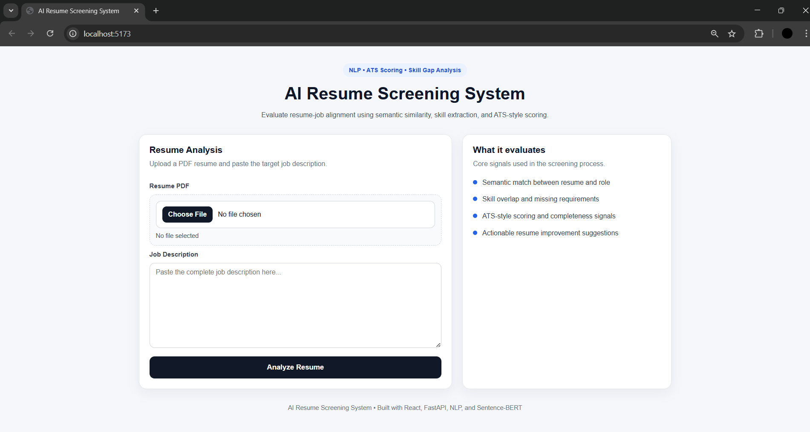
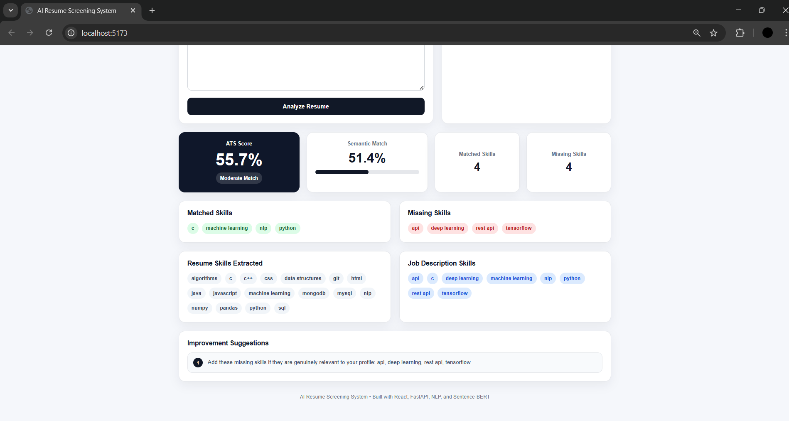
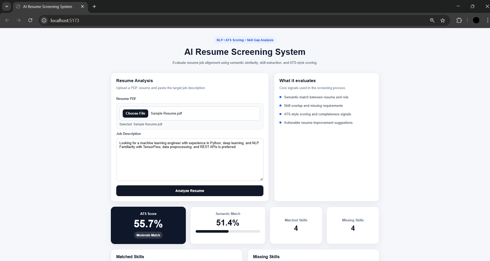

# AI Resume Screening System

An AI-powered system that analyzes resumes against job descriptions using Natural Language Processing and transformer embeddings to generate ATS-style scores, detect skill gaps, and provide resume improvement suggestions.

---

## Overview

The **AI Resume Screening System** evaluates how well a resume matches a job description by analyzing:

- semantic similarity between resume and job description
- skill overlap and missing requirements
- ATS-style scoring signals
- actionable resume improvement suggestions

Instead of simple keyword matching, the system uses **transformer-based embeddings** to understand the meaning of the text.

---

## Preview

### Interface



### Resume Analysis Results






---

## Key Features

- Resume PDF parsing
- Semantic similarity analysis
- ATS-style resume scoring
- Skill extraction from resume and job description
- Skill gap detection
- Resume improvement suggestions
- Clean and recruiter-friendly UI
- Full-stack AI application

---

## Tech Stack

### Backend
- Python
- FastAPI
- Sentence Transformers
- scikit-learn
- PyMuPDF

### Frontend
- React
- Axios
- CSS

### AI / NLP
- Sentence-BERT embeddings
- Cosine similarity
- Skill extraction

---

## Project Structure

```
ai-resume-screening-system
│
├── backend
│   ├── app
│   │   ├── main.py
│   │   ├── routes
│   │   │   └── analyze.py
│   │   └── services
│   │       ├── embedder.py
│   │       ├── pdf_parser.py
│   │       ├── preprocess.py
│   │       ├── scorer.py
│   │       ├── skill_extractor.py
│   │       └── suggestions.py
│   │
│   └── requirements.txt
│
├── frontend
│   ├── src
│   │   ├── App.jsx
│   │   ├── main.jsx
│   │   └── index.css
│   │
│   └── package.json
│
├── preview.png
├── analysis.png
├── Results.png
└── README.md
```

---

## How the System Works

1. User uploads a resume PDF  
2. User pastes a job description  
3. Resume text is extracted from the PDF  
4. Both texts are cleaned and preprocessed  
5. Sentence-BERT generates text embeddings  
6. Cosine similarity calculates semantic match  
7. Skills are extracted and compared  
8. The system generates:

- ATS Score  
- Matched Skills  
- Missing Skills  
- Resume Improvement Suggestions  

---

## Example Output

The system generates:

- ATS Score
- Semantic Match Percentage
- Resume Skills Extracted
- Job Description Skills
- Matched Skills
- Missing Skills
- Resume Improvement Suggestions

---

## Installation

### Clone the Repository

```
git clone https://github.com/harshithavibhuthi/ai-resume-screening-system.git
cd ai-resume-screening-system
```

---

## Backend Setup

```
cd backend
pip install -r requirements.txt
uvicorn app.main:app --reload
```

Backend runs on:

```
http://127.0.0.1:8000
```

---

## Frontend Setup

```
cd frontend
npm install
npm run dev
```

Frontend runs on:

```
http://localhost:5173
```

---

## Future Improvements

Possible extensions to this project include:

- Resume ranking across multiple job descriptions
- Job recommendation system
- Named Entity Recognition for advanced skill extraction
- Resume section-based scoring
- Dashboard analytics
- Multi-resume batch screening

---

## Author

Harshitha  
Computer Science Engineering Student  
AI / ML Enthusiast

---

## License

This project is intended for educational and research purposes.

---

## Push Updates to GitHub

```
git add .
git commit -m "Update README and add project screenshots"
git push origin main
```
